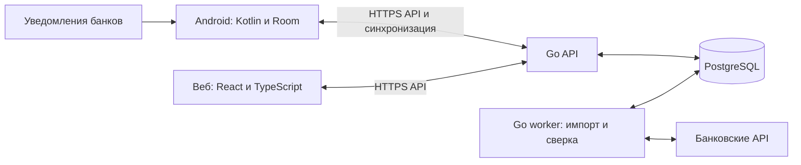

# План реализации приложения учета финансов

## Цель

Создать приложение учета личных финансов по образцу Wallet от BudgetBakers: Android-приложение, веб-интерфейс и сервер на Go с PostgreSQL.

Разработка начинается с серверной части и веб-интерфейса, затем реализуются приложения, после них — остальные функции и подготовка выпуска. Проверка банковских источников и все подключения банков выполняются только в самом конце. Первая версия работает с ручным вводом и CSV без зависимости от банковских доступов.

Ориентир по функциональности: счета, расходы и доходы, бюджеты, плановые платежи, отчеты и банковская синхронизация.

Источники: [функции Wallet](https://budgetbakers.com/en/products/wallet/features/), [планирование финансов](https://budgetbakers.com/en/solutions/personal/).

## 1. Первая версия — MVP

| Область | Функции |
|---|---|
| Пользователь | Регистрация, вход, управление устройствами |
| Счета | Наличные, банковские счета, карты; разные валюты |
| Операции | Расходы, доходы, переводы, возвраты, разделение операции по категориям |
| Категории | Дерево категорий, теги, правила автоматической категоризации |
| Бюджеты | Месячные лимиты по категориям, остаток бюджета, предупреждения |
| Аналитика | Доходы и расходы за период, категории расходов, динамика баланса |
| Автоматический импорт (финальный этап) | Уведомления выбранных банковских приложений; API для поддерживаемых банков |
| Импорт и экспорт | CSV, предпросмотр импорта, поиск дублей |
| Синхронизация | Работа Android без интернета, последующая синхронизация с сервером |

Следующие этапы: семейный доступ, цели накоплений, регулярные операции, прогноз остатка, долги, OCR чеков. Инвестиции и сложные AI-функции выделяются в отдельные этапы.

## 2. Получение транзакций без ручного ввода

Прямого универсального доступа к данным всех банковских приложений нет. Необходимо объединить несколько источников.

| Способ | Что получаем | Ограничения | Приоритет |
|---|---|---|---|
| Open Banking / API агрегатора | Историю, операции, счета, остатки | Покрытие зависит от страны и банка; договор, стоимость, повторная авторизация | Основной источник там, где доступен |
| Уведомления банковских приложений | Новые операции почти сразу | Неполная история, разные форматы, пропущенные или скрытые уведомления | Основной Android-вариант для остальных банков |
| SMS | Операции из банковских сообщений | Разрешения Google Play, стоимость SMS у банка, изменение форматов | Дополнительный канал |
| Выписки CSV / OFX | Историю операций | Пользователь периодически экспортирует файл | Резерв и первоначальное заполнение |
| Собственный официальный API банка | Данные конкретного банка | Отдельная интеграция и условия доступа | По запросу пользователей |

### Вариант A — банковский API

Пользователь выбирает банк, проходит авторизацию через предусмотренный провайдером сценарий и выбирает счета. Сервер получает операции и остатки.

Для европейских банков исследовать GoCardless Bank Account Data и Tink. Plaid — еще один кандидат, покрытие которого необходимо проверять под выбранный рынок. Выбор делать по конкретным банкам, доступным типам счетов, условиям подключения и стоимости.

Документация GoCardless отмечает ограничения частоты запросов со стороны банков: обновление нельзя обещать всегда мгновенным.

Источники: [GoCardless](https://docs.gocardless.com/docs/bank-account-data), [Tink](https://www.tink.com/account-aggregation/).

### Вариант B — чтение уведомлений на Android

Реализовать `NotificationListenerService`:

1. Пользователь явно включает доступ к уведомлениям.
2. Выбирает банковские приложения и соответствующие счета.
3. Приложение локально извлекает сумму, валюту, магазин, время и доступный идентификатор карты.
4. Создает предварительную операцию и отправляет структурированные данные на сервер.
5. Если позже приходит банковская операция через API, приложение сопоставляет записи.

Механизм получает уведомления, а не банковскую историю. Нельзя гарантировать получение всех операций. Android 15 также ограничивает доступ к содержимому уведомлений с обнаруженными OTP.

Парсеры делать отдельными для каждого банка, с версиями и тестами на обезличенных примерах. На сервер по умолчанию отправлять разобранные поля; полный текст уведомлений не хранить постоянно.

Источники: [NotificationListenerService](https://developer.android.com/reference/android/service/notification/NotificationListenerService), [ограничения Android 15](https://developer.android.com/about/versions/15/behavior-changes-all).

### Вариант C — SMS

Google Play предусматривает исключение для SMS-based money management, но требуется декларация разрешений и соответствие правилам. SMS нельзя закладывать как гарантированно доступный канал до проверки публикации.

Источник: [правила Google Play](https://support.google.com/googleplay/android-developer/answer/10208820?hl=en).

### Рекомендуемый подход

Ручной ввод и CSV-импорт для раннего MVP. Уведомления банковских приложений, SMS и банковские API реализовывать только на финальном этапе, после готовности остальных функций и выпуска базовой версии. Для поддерживаемых банков API будет источником подтвержденных операций, уведомления — быстрым предварительным сигналом.

## 3. Архитектура

Веб и PostgreSQL запускаются в отдельных Docker-контейнерах; API и worker также входят в Docker Compose. Веб предоставляет общий HTTPS origin и проксирует API. БД доступна во внутренней сети и хранит данные в постоянном volume. Миграции выполняются одноразовым контейнером до API/worker; тестовая БД изолирована. Подробности — в [решении об окружении](docs/decisions/007-repository-structure.md#docker-окружение).

### Сервер

Модульный монолит на Go, отдельные процессы API и фонового worker из одной кодовой базы. Это позволит быстрее разработать продукт и держать финансовые изменения в транзакциях PostgreSQL.

Модули:

- пользователи, сессии и права доступа;
- счета и финансовые операции;
- категории и правила;
- бюджеты и отчеты;
- импорт и банковские подключения;
- синхронизация устройств;
- аудит изменений.

### Android

Kotlin, Jetpack Compose, Room для локальных данных, WorkManager для отложенной синхронизации. Нативный Android удобен для работы с уведомлениями и фоновыми задачами.

### Веб

React + TypeScript. Общий API с Android. Основные сценарии: просмотр финансов, массовое редактирование, бюджеты и импорт выписок.

### PostgreSQL

Основное хранилище, очередь фоновых заданий на первом этапе, таблица изменений для синхронизации. Redis и отдельный брокер добавлять при появлении измеримой необходимости.

## 4. Финансовая модель и база

| Сущности | Назначение |
|---|---|
| `users`, `workspaces`, `memberships` | Пользователи и пространство финансов; основа будущего семейного доступа |
| `accounts` | Счета, валюта, тип, начальный остаток |
| `transactions`, `entries` | Операции и движения по счетам |
| `categories`, `tags`, `rules` | Классификация операций |
| `budgets` | Лимиты и периоды |
| `bank_connections`, `external_accounts` | Банковские подключения и сопоставление счетов |
| `source_events`, `transaction_sources` | Полученные события и связь источников с операциями |
| `sync_changes`, `audit_events` | Изменения для устройств и аудит |

Принципиальные решения:

- Денежные значения хранить точно: `NUMERIC` либо целое число минимальных денежных единиц с правилами валюты; не `float`.
- Перевод между своими счетами считать одной связанной операцией с двумя движениями, исключать из доходов и расходов.
- Для валютного перевода хранить обе суммы, валюты и примененный курс.
- Разделять предварительные и подтвержденные операции.
- Разделять вычисленный остаток и остаток, сообщенный банком; расхождения показывать при сверке.
- Изменения категории пользователем сохранять при повторном импорте.
- Остаток изменять только через финансовые движения, включая явную корректировку.

### Дедупликация

Одна покупка может прийти из уведомления, SMS, выписки и API. Сначала использовать идентификаторы источников, затем сопоставление по счету, валюте, сумме, времени и продавцу. Совпадение суммы и даты само по себе недостаточно.

Переход `pending → posted` обрабатывать явно: например, у Plaid подтвержденная операция может получить новый идентификатор и ссылку на предварительную.

Источник: [модель транзакций Plaid](https://plaid.com/docs/transactions/transactions-data/).

## 5. Синхронизация Android и веба

Android должен позволять добавлять и редактировать операции без интернета:

- локальные изменения записываются в очередь отправки;
- каждое действие имеет уникальный ключ, повторная отправка безопасна;
- сервер проверяет версию записи и возвращает изменения после курсора;
- удаления передаются как отметки удаления;
- конфликт финансовых правок показывается пользователю;
- банковские поля и пользовательские поля обрабатываются отдельно.

На вебе изменения идут через тот же сервер. Сервер отвечает за согласованное состояние между устройствами.

## 6. Защита данных и эксплуатация

Включать защиту данных с начала реализации; меры для банковских токенов и подключений внедрить вместе с финальной банковской интеграцией:

- проверку доступа к каждому счету и операции;
- защищенные сессии, отзыв доступа устройств;
- шифрование банковских токенов, хранение Android-секретов через Keystore;
- исключение токенов и финансовых текстов из логов;
- резервные копии PostgreSQL с проверкой восстановления;
- экспорт и удаление пользовательских данных;
- мониторинг ошибок импорта, задержки синхронизации и состояния подключений.

Для банковского провайдера отдельно проверить условия обработки данных и требования целевого рынка. Не хранить банковские пароли в своей системе.

## 7. Этапы реализации

Оценка предполагает команду из трех разработчиков — Go, Android, веб — с частичным участием дизайнера и QA. Это ориентир, а не фиксированный срок.

| Этап | Результат | Срок |
|---|---|---|
| 1. Серверная часть и веб-интерфейс | Проектирование в рамках этапа, Go API, PostgreSQL, авторизация, счета, операции, категории и рабочий веб | Уточнить после декомпозиции |
| 2. Приложения | Android, локальный учет, офлайн-синхронизация с готовым сервером и вебом | Уточнить после этапа 1 |
| 3. Бюджеты и отчеты | Лимиты, диаграммы, фильтры, правила категоризации | 2–3 недели |
| 4. CSV-импорт и экспорт | Предпросмотр, подтверждение импорта, дедупликация, экспорт | Уточнить отдельно от банков |
| 5. Подготовка и выпуск базовой версии | Проверка безопасности, восстановления, устройств и публикации без банковских подключений | 2–3 недели |
| 6. Подключение банков — финальный этап | Проверка целевых банков и API-покрытия, парсеры уведомлений, провайдер, сверка и приемка банковских сценариев | Уточнить после проверки источников |

Срок до публичного MVP пересчитать после декомпозиции сервера, веба и приложений. Коммерческое подключение банковского провайдера влияет только на финальный банковский этап и не блокирует выпуск базовой версии. Полноценный аналог Wallet потребует дальнейшего развития.

## 8. Проверки перед выпуском

Ключевые сценарии приемки (уведомления, банковская сверка и статусы подключений проверяются на финальном этапе; остальные — перед выпуском базовой версии):

- повторный импорт не создает дубли;
- две одинаковые покупки сохраняются как две операции;
- уведомление и банковская запись сопоставляются без потери категории;
- переводы не увеличивают доходы и расходы;
- офлайн-изменения доходят до веба после восстановления связи;
- возвраты, отмены, комиссии и валютные операции учитываются корректно;
- отключенное банковское подключение имеет понятный статус;
- пользователь не может получить данные другого пользователя.

## 9. Первый практический шаг

Начать с модели финансового учета, API-контракта и реализации Go-сервера с PostgreSQL и веб-интерфейса: регистрация → счет → ручная операция → корректный остаток. Затем реализовать приложения.

Страну, 3–5 банков для пилота, стоимость подключения и объем парсеров определить на финальном банковском этапе.
