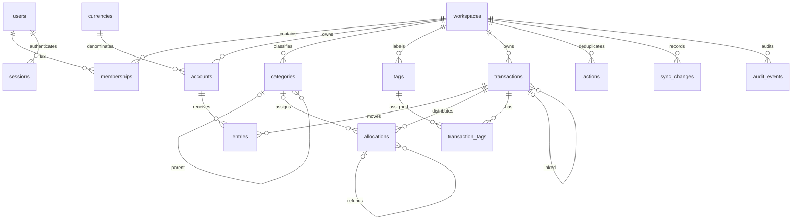

# 003. Финансовая модель и словарь полей

Дата: 2026-10-04. Статус: принято для проектирования контрактов, S2-02.
Входы: [сценарии](001-mvp-scenarios.md), [экраны](002-screen-specifications.md).

## Деньги и время

Суммы хранятся в PostgreSQL BIGINT в минимальных единицах валюты. API передает целые значения строками `amount_minor`, включая знак для движений; клиенты преобразуют ввод по справочнику валют. Go использует int64 с явной проверкой переполнения; суммирование нескольких движений проверяется до записи. Промежуточные суммы вычисляются с произвольной точностью; входные суммы и остатки одного счета проверяются перед преобразованием в int64. Отчетные агрегаты используют отдельный AggregateMoney. Денежные значения не проходят через float или JavaScript Number.

Начальный справочник приложения: EUR, USD, RUB, GBP с scale=2, JPY с scale=0, KWD с scale=3. Это выбранный объем MVP, не исчерпывающий стандарт валют. Scale неизменяем после появления счета; расширение справочника — отдельная миграция. 12.34 EUR = 1234; 12 JPY = 12; 1.234 KWD = 1234. Лишние знаки, экспонента и разделители тысяч запрещены в API. UI может принять запятую и нормализовать ее. Максимальный модуль входного значения — 9 000 000 000 000 000 минимальных единиц; posted_balance, pending_delta и projected_balance каждого счета также должны укладываться в этот диапазон. Суммы отчетов/бюджетов и итоги нескольких счетов могут быть больше: AggregateMoney допускает до 40 десятичных цифр (знак отдельно); float не используется. Округление при вводе не применяется.

Курс перевода хранится точно как пара положительных целых чисел: `rate_numerator/rate_denominator`, выражающая целевые основные единицы на одну исходную. Для исходной суммы S, целевой D и точностей s,d отношение равно `(D * 10^s)/(S * 10^d)`, сокращенное на НОД; промежуточные расчеты используют произвольную точность. Поэтому курс 1/3 сохраняется без усечения. Клиент вводит обе денежные суммы, сервер вычисляет курс; если клиент прислал курс, принимается только точно эквивалентная дробь. Отображение курса может округляться до 8 знаков HALF_EVEN и не используется для пересчета сохраненных сумм.

`occurred_at`, `created_at`, `updated_at`, `deleted_at` — однозначные UTC-моменты; `occurred_timezone` — исходная IANA-зона, сохраняемая для отображения. Границы периодов преобразуются из зоны пользователя в UTC; фильтр времени полуоткрытый [from,to). Будущие финансовые операции пока запрещены: плановые платежи будут отдельной сущностью. Начальная дата не позже текущего времени, движение до даты открытия счета запрещено.

## Сущности и связи

UUID идентифицируют сущности, клиент может заранее генерировать UUID для офлайн-действий. У всех принадлежащих пространству записей есть `workspace_id`; связанные ссылки используют составные FK `(workspace_id,id)`, исключая межпространственные связи. Все пользовательские операции дополнительно проверяют активное membership. UUID не является разрешением доступа.

## Словарь основных таблиц

Общий набор изменяемой синхронизируемой сущности: `id UUID`, `workspace_id UUID`, `version BIGINT > 0` (начинается с 1), `created_at`, `updated_at`, `deleted_at nullable`. Версия увеличивается при любом изменении видимых полей; время не заменяет версию.

| Таблица | Специфические поля и ограничения |
|---|---|
| users | id, email_normalized UNIQUE, password_hash, timezone, created_at, disabled_at; email и хеш не входят в финансовую синхронизацию |
| workspaces | id, name, owner_user_id, version, created_at; одно личное пространство создается при регистрации |
| memberships | workspace_id + user_id PK, role=owner/member, revoked_at; MVP создает owner; UI приглашений отложен |
| sessions | id, user_id, device_name, token_hash, created_at, last_seen_at, expires_at, revoked_at; сырой токен не сохраняется |
| currencies | code PK, scale; фиксированный справочник выше |
| accounts | общий набор; name (1–100 символов), type=cash/bank/card, currency_code, opened_at, archived_at, balance_version > 0; банковский тип не означает наличие подключения |
| transactions | общий набор; kind=opening/expense/income/transfer/refund/adjustment, status=pending/posted, occurred_at, occurred_timezone, note (до 2000), payee (до 200), parent_transaction_id nullable, rate_numerator/denominator nullable, reason nullable |
| entries | id, workspace_id, transaction_id, account_id, amount_minor != 0; валюта определяется счетом; уникальная пара transaction_id/account_id; активность определяется родительской операцией |
| allocations | id, workspace_id, transaction_id, category_id nullable, amount_minor > 0, original_allocation_id nullable; без категории означает «Без категории» |
| categories | общий набор; name (1–100), parent_id nullable, archived_at; циклы запрещены, изменение дерева сериализуется блокировкой пространства |
| tags | общий набор; name (1–50), archived_at; активное имя уникально в пространстве после нормализации |
| transaction_tags | workspace_id, transaction_id, tag_id; составной PK исключает повтор |
| actions | workspace_id + actor_user_id + action_id PK, canonical_request_hash, state=applied/rejected, original_http_status, response_body nullable, completed_at, response_expires_at, group_sequence nullable, generation_id nullable (только applied), entity_refs; полный ответ 30 суток, компактная квитанция на жизнь пространства; domain rejection не меняет финансы |
| sync_heads | workspace_id PK, generation_id UUID, last_sequence >=0, min_available_sequence >=1; mutex порядка записи |
| sync_groups | workspace_id + generation_id + sequence PK, action_id, actor_user_id, created_at, change_count, payload_bytes; одна группа на успешное действие |
| sync_changes | workspace_id + generation_id + sequence + ordinal PK, change_id UNIQUE, entity_type, entity_id, entity_version, operation=upsert/delete, payload, created_at; атомарно с группой |
| sync_snapshots | actor/workspace/id, generation_id, base_sequence, created_at, expires_at, item_count; immutable снимок, TTL 15 минут, после очистки остается маркер id |
| sync_snapshot_items | snapshot_id и position, полный payload; не изменяется после создания |
| audit_events | id, workspace_id, actor_user_id, action_id, entity_type/id, event_type, timestamp; без паролей, токенов, заметок и полного финансового payload |

`balance_version` счета увеличивается на 1 за каждое успешно выполненное действие, меняющее его движения, включая изменение даты/статуса и удаление. Любое изменение синхронизируемого представления счета меняет `version`, финансовые движения также меняют `balance_version`; обе версии и вычисленные остатки входят в ответ и синхронизируемое представление счета. Версии разных счетов обновляются в той же транзакции.

Начальный нулевой остаток: создается opening без entries; ненулевой — ровно одно signed entry. Одна opening на счет (включая удаленные записи); opening не удаляется и меняется только отдельной операцией корректировки. Это сохраняет дату открытия и не позволяет обходить проверку валюты.

## Формы операций и итоги

| Тип | Движения | Распределения и отчетная классификация |
|---|---|---|
| opening | 0 или 1 движение; сумма может быть отрицательной | Нет allocations; не доход/расход |
| expense | 1 отрицательное движение | Сумма allocations = модулю движения; положительные расходы |
| income | 1 положительное движение | Сумма allocations = движению; положительные доходы |
| transfer | 2 движения: отрицательное исходное, положительное целевое | Нет allocations; разные счета; одинаковая валюта требует равных модулей; разная требует точного курса; не доход/расход |
| refund | 1 положительное движение в валюте исходного расхода | parent указывает expense; allocations ссылаются на исходные части; отрицательные расходы, не доход |
| adjustment | 1 ненулевое signed движение | Причина обязательна; без allocations; не доход/расход |

Комиссия — expense с `parent_transaction_id` указывающим transfer, отдельными entries и allocations. При создании/изменении перевода сервер принимает комиссию как часть единого действия и сохраняет обе операции атомарно. У перевода не более одной активной комиссии; ее счет может отличаться от обоих счетов перевода. Удаление перевода атомарно удаляет комиссию; самостоятельное удаление комиссии допустимо, но меняет версию родительского перевода. Все изменения комиссии проверяют версию родителя и ее собственную версию.

Остаток `posted_balance` = сумма движений неудаленных posted-операций; `pending_delta` = сумма pending; `projected_balance` = их сумма. Первый этап создает только posted вручную. Отчеты включают только posted и фильтруют дату по occurred_at; opening, adjustment и transfer исключаются. Деление на категории использует allocations, а не повторное сложение entries. Возврат уменьшает расход в периоде самого возврата. Банковский остаток никогда не заменяет эти суммы.

## Возвраты, правки и удаления

Валюта expense/income/refund/комиссии неизменна после создания; смена счета допустима только в той же валюте. У transfer фиксируется исходная пара валют: исходный и целевой счета заменяются только счетами соответствующих валют. Пересоздание операции с новой валютой — отдельное явное действие, не интерпретация старой суммы в новых единицах.

Refund.parent_transaction_id неизменен. original_allocation_id каждой его части должен принадлежать этому расходу, быть уникальным в возврате и не ссылаться на часть другого возврата. Сумма возврата равна сумме его частей; лимит проверяется отдельно по каждой исходной части, а не только по общему расходу. remaining_refundable_minor вычисляется для expense; для остальных типов всегда 0. Дата возврата не раньше расхода и открытия счета возврата.

Существующая комиссия сохраняет свой UUID при PUT перевода. Ее дата равна дате перевода; изменение даты перевода при активных возвратах комиссии запрещено. Новая комиссия — новый UUID после явного удаления старой и проверки зависимостей. Изменение возвращенного расхода сравнивает части по UUID/сумме/категории, а не по порядку массива. Нельзя обойти ограничения изменением комиссии через родительский PUT.

Возврат допускается на другой активный счет той же валюты. Дата не раньше исходного расхода. Исходная операция должна быть posted expense; комиссия тоже expense и допускает возврат. По каждой исходной части сумма всех активных posted и pending возвратов не превышает ее сумму. Архивная исходная категория сохраняется в возврате как исключение из запрета нового назначения архивных категорий.

При наличии возвратов блокируется изменение счета, валюты, даты, частей и категории исходного расхода; разрешены заметка, контрагент и теги. Для финансовой правки сначала удаляются возвраты. Возврату можно менять суммы частей в пределах лимитов; ссылки и категории определяются исходными allocations. UUID частей сохраняются при правке; старые части с зависимостями не заменяются новыми идентификаторами.

Мягкое удаление transaction исключает entries и allocations из вычислений, оставляя их для истории; транзакция, ее связи и изменения версий публикуются атомарно. Расход с активными возвратами удалить нельзя. Перевод с комиссией, на которую есть возвраты, удалить нельзя до удаления этих возвратов. Удаление уже удаленной записи с другим действием возвращает конфликт; повтор исходного action возвращает исходный результат. Восстановление удаленных финансовых операций пока отсутствует.

Архивный счет доступен для чтения. Создание, правка и удаление финансовых операций, затрагивающих его, запрещены до восстановления. Архивирование не меняет остаток. Физическое удаление счетов и используемых категорий в MVP отсутствует. Валюта счета неизменна после создания, в том числе при нулевой opening: это более простое правило интерфейса вместо проверки исторических движений.

## Атомарность и конкурентные действия

Одно действие: shared lock users → shared lock сессии с повторной проверкой токена и срока → shared lock активной membership → блокировка sync_heads пространства → резервирование action → блокировки → проверка ожидаемых версий и инвариантов → запись операций/entries/allocations → версии счетов → журнал изменений/аудит → результат action → commit. Ошибка откатывает все финансовые изменения. Ответ успешен только после commit.

После блокировки sync_heads в каждом финансовом действии блокируются все затронутые счета в порядке UUID, затем все существующие операции в порядке UUID. Набор связанных комиссий/возвратов определяется после блокировок и повторно проверяется; если обнаружен дополнительный счет, действие откатывается и повторяется с полным набором. Создание возврата также блокирует исходную операцию; два одновременных возврата не могут вместе превысить лимит. Изменение membership сериализуется с авторизацией действия, чтобы отзыв доступа не обходился незавершенным запросом. Реализация должна иметь единый порядок блокировок во всех командах и ограниченные повторы deadlock/serialization ошибок.

Обычная запись расхода не требует ожидаемой версии остатка счета: два независимых расхода сохраняются оба. Корректировка требует `expected_balance_version` и `target_balance_minor`; после блокировки сервер вычисляет текущий posted_balance и разницу. Нулевая разница дает ошибку `no_change`. При конкурентном движении версия расходится и возвращается конфликт, новое движение не создается. Изменение существующей корректировки разрешает только заметку; сумму изменяют новой корректировкой. Это исключает неоднозначность повторного расчета исторической цели.

Версия transaction защищает весь агрегат: entries, allocations, теги, ссылки. Клиент не изменяет эти дочерние таблицы напрямую. Массовая правка проверяет все версии до записи, полностью откатывается при любой ошибке и не меняет balance_version, если менялись только категории/теги.

Создание, финансовая правка и удаление возврата также увеличивают version исходного расхода: доступная сумма возврата является частью его представления. Запрос возврата передает ожидаемую версию исходного расхода, а правка/удаление — также версию возврата. Поэтому при двух конкурентных возвратах второй может сначала получить version_conflict; после загрузки актуального расхода повторная попытка проверяется по оставшемуся лимиту. При возврате комиссии обновляются и версия комиссии, и версия связанного перевода.

Суммы частей, циклы, формы движений и лимиты возврата — межстрочные инварианты; они проверяются сервисом внутри транзакции и защищаются от обхода ограничением прав записи на БД. FK/CHECK/UNIQUE поддерживают локальные ограничения. При S3-02 дополнительно реализовать deferred проверки форм движений и сумм частей либо доказать, что единственный путь записи через сервис полностью покрыт интеграционными тестами. Проверка здесь — проектирование, не доказательство работающей БД.

## Исторические назначения и архив

При полном PUT неизмененные архивные category/tag назначения разрешено сохранять. Проверка активного состояния применяется к новым назначениям (разница UUID текущего и желаемого набора); проверка workspace/FK применяется ко всем ссылкам. Так правка заметки не требует заменить историческую категорию. Новые операции не назначают архивные категории/теги, исключение — категория возврата из исходной части. Аналогично неизмененный архивный parent категории допускается при правке имени, новый архивный parent запрещен. Циклы проверяются по всему дереву, включая архив.

## Поздние сущности и границы

budgets: workspace, категория, валюта, календарный месяц, limit_minor. rules: workspace, приоритет, условие, пользовательское действие. Дедупликация импорта не опирается на финансовое равенство суммы/даты.

bank_connections, external_accounts, source_events, transaction_sources появятся на финальном этапе. Источник связан с transaction отдельно; внешние факты не перезаписывают allocations, tags и note пользователя. Bank balance — отдельный снимок с account_id, amount_minor, observed_at и источником. Здесь определены границы, исследование провайдеров не выполнялось.

## Контрольные доказательства и следующий шаг

[Фикстуры](../../contracts/fixtures/financial-model.json) содержат положительные примеры и ожидаемые отказы. [Проверка](../../contracts/fixtures/check_financial_model.py) независимо складывает подписанные минимальные единицы и итоги категорий. Она проверяет спецификацию, не будущую реализацию ядра.

Финансовая модель согласована с [API](004-api-contract.md) и [протоколом синхронизации](005-sync-protocol.md). Решения по финансовой модели и срокам хранения квитанций приняты; доказательство их реализации остается в S3. Валютные возвраты с конвертацией и общая оценка разных валют не входят в начальный объем.
